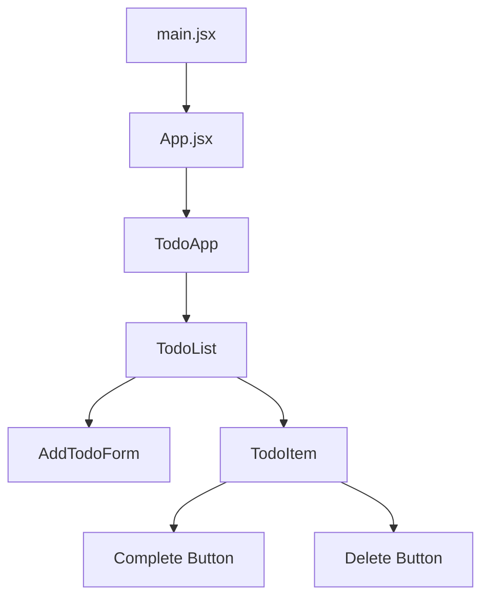
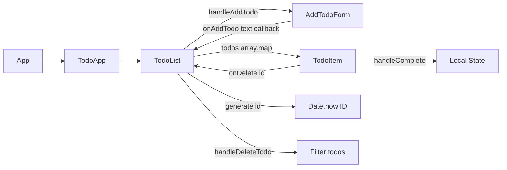

# 📝 Todo App - Task Management

Сучасний список завдань побудований на **Vite + React** з використанням **Hooks** та **CSS модулів**. Простий, стильний і зручний додаток для керування задачами з інтуїтивним інтерфейсом.

---

## 🚀 Стек технологій

- [Vite](https://vitejs.dev/) – швидкий збірник для фронтенду
- [React 18](https://react.dev/) – бібліотека для побудови UI
- [React Hooks](https://react.dev/reference/react) – управління станом та логікою
- CSS модулі – ізольована стилізація компонентів

---

## 🌳 Component Tree (CT)



---

## 🔄 Data Flow Diagram (DF)



---

## ⚙️ Основні Hooks

### useState
- **AddTodoForm.jsx** – керування введеним текстом `inputValue`
- **TodoList.jsx** – зберігання масиву завдань `todos[]`
- **TodoItem.jsx** – стан завершення завдання `isCompleted`

### Приклад використання:

```javascript
// У TodoList.jsx
const [todos, setTodos] = useState([
  { id: 1, text: "Complete the React course." },
  { id: 2, text: "Get started with Node.js" },
  // ...інші завдання
])

const handleAddTodo = (text) => {
  const newTodo = {
    id: Date.now(),
    text: text,
  }
  setTodos((prevTodos) => [...prevTodos, newTodo])
}
```

---

## ▶️ Запуск проєкту

```bash
# 1. Клонувати репозиторій
git clone https://github.com/username/vite-todo-app.git
cd lab3

# 2. Встановити залежності
npm install

# 3. Запустити dev-сервер
npm run dev

# 4. Відкрити в браузері
http://localhost:5173
```

---

## 📌 Функціонал

✅ **Додавання завдань** – через форму з валідацією

✅ **Видалення завдань** – кнопка видалення для кожного завдання

✅ **Позначка "виконано"** – toggle статусу завершення

✅ **Попередньо заповнений список** – 4 демо-завдання

✅ **Responsive дизайн** – адаптивний інтерфейс

✅ **Очищення форми** – автоматичне очищення після додавання

---

## 🔧 Деталі реалізації

### Управління станом
- Централізований стан todos в `TodoList.jsx`
- Передача функцій як props до дочірніх компонентів
- Immutable оновлення стану через `setTodos`
- Локальний стан `isCompleted` в кожному `TodoItem`

### Стилізація
- **CSS модулі** для кожного компонента
- Ізольовані стилі без конфліктів
- Адаптивний дизайн

### Ідентифікація
- Використання `Date.now()` для унікальних ID
- Безпечна ідентифікація завдань при додаванні

---

## 💡 Архітектурні рішення

### Розділення відповідальності:
- **TodoApp** – контейнер з заголовком
- **TodoList** – управління списком та бізнес-логіка
- **TodoItem** – рендеринг окремого завдання
- **AddTodoForm** – форма введення нових завдань

### Props Flow:
- `onAddTodo` передається з TodoList до AddTodoForm
- `todo` та `onDelete` передаються з TodoList до TodoItem
- Локальний стан `isCompleted` керується в TodoItem


## 💡 Висновок

Цей проєкт демонструє:
- 🏗️ Побудову **Component Tree** з чіткою ієрархією
- 🔄 Організацію **Data Flow** через props та callbacks
- ⚡ Ефективне використання **React Hooks**
- 🎨 Модульну архітектуру стилів
- 📦 Швидку збірку з **Vite**
