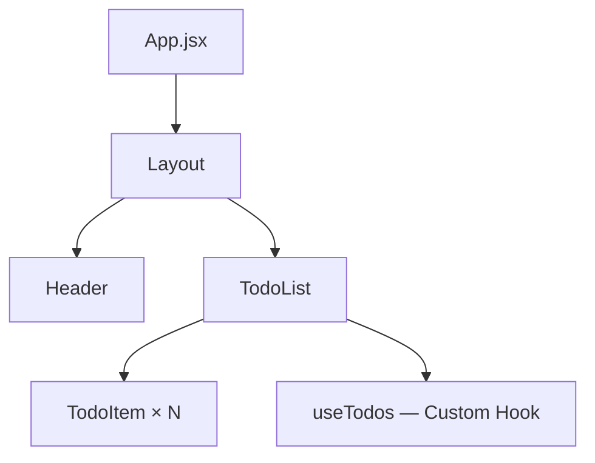
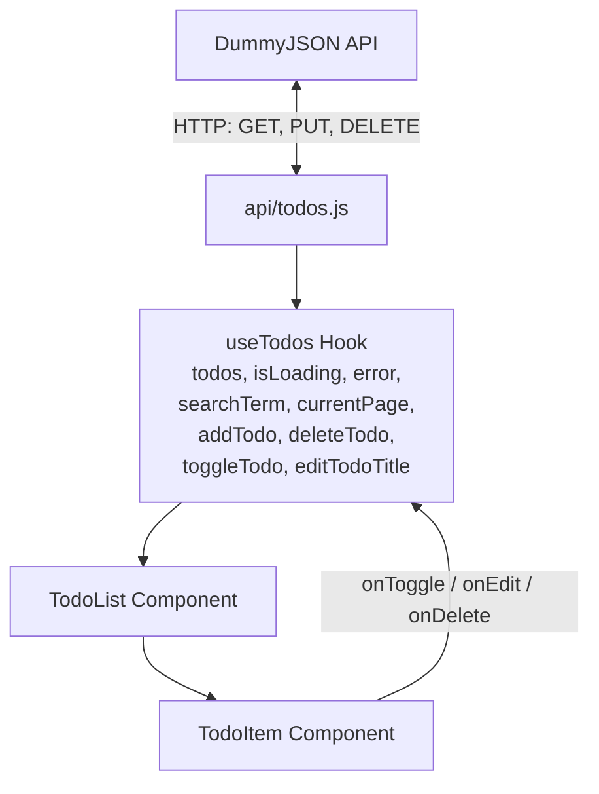

# ✅ Lab 5–6: React Design Patterns

Розширена версія **Todo List** застосунку, створена на **React + Vite**, з використанням **Custom Hook (useTodos)**, публічного API [DummyJSON](https://dummyjson.com/todos), а також реалізацією **пошуку, пагінації** та **редагування назв завдань**.  
Усі запити виконуються частково (Partial API Requests), без зовнішнього сховища — лише локальний стан клієнта.

---

## 🚀 Запуск проєкту

```bash
# встановлення залежностей
npm install

# запуск у dev режимі
npm run dev

# білд у продакшн
npm run build

# попередній перегляд білда
npm run preview

---
## 📂 Структура проєкту

```
lab5-6/
├── api/
│   └── todos.js             # API-функції (fetch, delete, toggle, edit)
├── components/
│   ├── Header.jsx           # Заголовок із підзаголовком
│   ├── Layout.jsx           # Layout з Header та main
│   ├── TodoItem.jsx         # Окреме завдання (toggle / edit / delete)
│   └── TodoList.jsx         # Основна логіка: додавання, пошук, пагінація
├── hooks/
│   └── useTodos.js          # Custom hook з усією логікою (CRUD, search, pagination)
├── styles/
│   ├── app.module.css       # Глобальні стилі (layout, header, main)
│   ├── todolist.module.css  # Стилі для списку, input, кнопок, пагінації
│   └── todoitem.module.css  # Стилі для елементів списку (edit, hover, completed)
├── App.jsx                  # Root-компонент, який лише рендерить Layout + TodoList
├── main.jsx                 # Точка входу (ReactDOM.createRoot)
└── README.md                # Опис проєкту, діаграми та патерни

---

## 🌳 Component Tree


---

### Пояснення:

* **App** – головний компонент, композиційний root, не має власного стану.  
  Рендерить компонент `Layout` і виступає коренем додатка.

* **Layout** – контейнер із заголовком (`Header`) і основною частиною (`main`).  
  Використовується для побудови базового макета сторінки.

* **Header** – виводить назву списку завдань і підзаголовок із коротким описом.  
  Не має жодної логіки, лише презентаційний компонент.

* **TodoList** – головний функціональний компонент, який відповідає за логіку роботи зі списком завдань:
  
    * форма для додавання нового завдання;
    * поле пошуку для фільтрації завдань за назвою;
    * список усіх завдань поточної сторінки;
    * кнопки пагінації (**Previous / Next**) для переходу між сторінками;
    * селектор для зміни кількості елементів на сторінці;

* **TodoItem** – відображає одну задачу зі списку, має локальний стан редагування:

    * кнопка **Edit** для переходу в режим редагування;
    * кнопки **Save** / **Cancel** для збереження або скасування змін;
    * кнопка **Видалити** для видалення завдання (`onDelete`);
    * змінює назву завдання через виклик `editTodoTitle()` із `useTodos`.
---

## 🔄 Data Flow Diagram



---

## 📋 Опис Data Flow

### 1️⃣ API шар (`api/todos.js`)

* **fetchTodosApi(limit, skip)** – отримує сторінку завдань із публічного API **DummyJSON**, використовуючи параметри `limit` та `skip` для реалізації пагінації.
* **deleteTodoApi(id)** – видаляє завдання на сервері за вказаним `id`.
* **toggleTodoApi(id, completed)** – змінює статус виконання завдання (PUT-запит).
* **editTodoTitleApi(id, newTitle)** – змінює назву завдання (PUT-запит із новим текстом).

> Локальні завдання (`id` починається з `local_`) **ігноруються API-функціями** та обробляються лише локально у стані клієнта.

---

### 2️⃣ Custom Hook (`useTodos.js`)

Відповідає за **всю логіку роботи з даними**, включно з CRUD, пагінацією та пошуком.

**Стани:**
* `todos` – поточна сторінка завдань (фільтрована за пошуковим запитом);
* `isLoading` – індикатор завантаження даних;
* `error` – повідомлення про помилку;
* `searchTerm` – значення рядка пошуку;
* `currentPage`, `limitPerPage`, `totalTodos` – параметри пагінації.

**Методи:**
* `addTodo(task)` – додає нове локальне завдання без звернення до API.
* `deleteTodo(id)` – оптимістично видаляє завдання зі стану та відправляє запит до API.
* `toggleTodo(id)` – змінює статус виконання завдання (оптимістичне оновлення + rollback при помилці).
* `editTodoTitle(id, newTitle)` – оновлює назву завдання (песимістичне PUT-оновлення через API).
* `setSearchTerm(term)` – змінює пошуковий термін для фільтрації списку.
* `goToNextPage()`, `goToPrevPage()`, `setLimit(limit)` – реалізують навігацію та налаштування пагінації.

---

### 3️⃣ UI шар

* **TodoList**
  * керує станом поля вводу для нового завдання;
  * викликає методи з `useTodos`;
  * реалізує пошук, пагінацію та змінну кількість елементів на сторінці;
  * показує повідомлення про завантаження, помилки чи порожній список;
  * рендерить усі завдання через компонент `TodoItem`.

* **TodoItem**
  * `checkbox` → викликає `toggleTodo(id)`;
  * кнопка **Edit** → переходить у режим редагування;
  * **Save / Cancel** → зберігає або скасовує редагування;
  * кнопка **Видалити** → викликає `deleteTodo(id)`;
  * працює з локальним станом `isEditing` та `draft` (поточний текст).

---

## ✨ Особливості

- ✅ Додавання нових завдань (локально)
- ✅ Видалення завдань (з оптимістичним оновленням UI)
- ✅ Відмітка завдань як виконаних
- ✅ Редагування назви завдання
- 🔍 Пошук за назвою
- 📄 Пагінація (5/10/20 елементів на сторінку)
- 🎨 Сучасний UI з glassmorphism ефектами 


---


