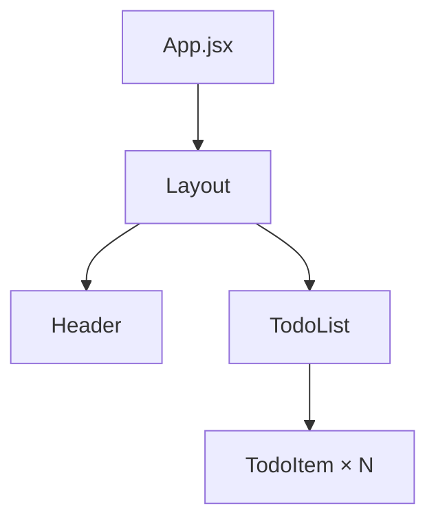
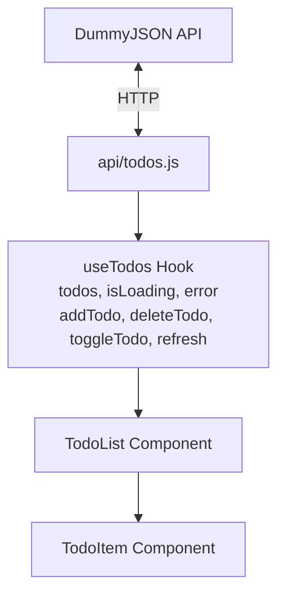

# ✅ Todo List App – Lab 4

Простий **Todo List** застосунок, створений на **React + Vite**, з використанням **Custom Hook** та інтеграцією з публічним API [DummyJSON](https://dummyjson.com/todos).
Додаток дозволяє додавати, видаляти та відмічати завдання як виконані.
Локальні завдання створюються без запиту на сервер і зберігаються лише у стані клієнта.

---

## 🚀 Запуск проєкту

```bash
# встановлення залежностей
npm install

# запуск у dev режимі
npm run dev

# білд у продакшн
npm run build

# попередній перегляд білда
npm run preview
```

---

## 📂 Структура проєкту

```
lab4/
├── api/
│   └── todos.js           # API функції (fetch, delete, toggle)
├── components/
│   ├── Header.jsx         # Заголовок з підзаголовком
│   ├── Layout.jsx         # Layout з Header та main
│   ├── TodoItem.jsx       # Окреме завдання (toggle/delete)
│   └── TodoList.jsx       # Основна логіка + форма додавання
├── hooks/
│   └── useTodos.js        # Custom hook для роботи з API
├── styles/
│   ├── app.module.css     # Глобальні стилі (layout, header, main)
│   ├── todolist.module.css# Стилі для списку та input
│   └── todoitem.module.css# Стилі для елементів списку
├── App.jsx                # Root-компонент з Layout + TodoList
├── main.jsx               # Точка входу (ReactDOM)
```

---

## 🌳 Component Tree



### Пояснення:

* **App** – головний компонент, обгортає застосунок у `Layout`.
* **Layout** – контейнер з `Header` та `main`.
* **Header** – виводить заголовок і підзаголовок.
* **TodoList** – містить логіку роботи зі списком:

    * форма для додавання завдання
    * список задач
    * повідомлення про завантаження / помилку
* **TodoItem** – рендерить одну задачу з checkbox та кнопкою видалення.

---

## 🔄 Data Flow Diagram



---

## 📋 Опис Data Flow

### 1️⃣ API шар (`api/todos.js`)

* **fetchTodosApi(limit)** – отримує список завдань
* **deleteTodoApi(id)** – видаляє завдання на сервері
* **toggleTodoApi(id, completed)** – змінює статус виконання

> Локальні завдання (`id` починається з `local_`) **ігноруються API функціями**.

---

### 2️⃣ Custom Hook (`useTodos.js`)

Відповідає за стан і взаємодію з API.

**Стани:**

* `todos` – масив завдань (API + локальні)
* `isLoading` – індикатор завантаження
* `error` – помилка

**Методи:**

* `addTodo(task)` – додає локальне завдання
* `deleteTodo(id)` – оптимістично видаляє із state + API
* `toggleTodo(id)` – оптимістично змінює статус + rollback при помилці
* `refresh()` – перезавантажує список із API

---

### 3️⃣ UI шар

* **TodoList**

    * керує станом input
    * викликає методи з `useTodos`
    * відображає список або повідомлення (завантаження / помилка / пусто)
  
* **TodoItem**

    * checkbox → `toggleTodo`
    * кнопка "Видалити" → `deleteTodo`

---

## ✨ Особливості

* **Оптимістичні оновлення** – зміни застосовуються одразу у UI ще до відповіді від API
* **Rollback при помилках** – якщо API зафейлиться, стан відновлюється
* **Локальні завдання** – створюються без запиту до сервера (id починається з `local_`)
* **Анімовані стилі** – використано `backdrop-filter`, градієнти та hover-ефекти

---


